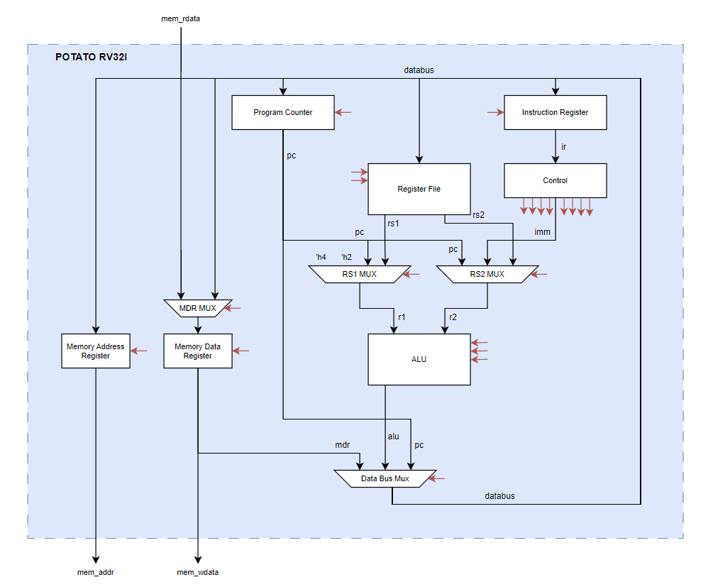

# Potato RISC-V Core

A clean, educational implementation of the RV32I base integer instruction set with machine-mode CSR support and trap handling. The design features a multi-cycle, non-pipelined architecture optimized for clarity, verifiability, and comprehensive testing.

## Table of Contents

1. [Architecture Overview](#architecture-overview)
2. [RTL Module Hierarchy](#rtl-module-hierarchy)
3. [Control Flow and FSM](#control-flow-and-fsm)
4. [Datapath Organization](#datapath-organization)
5. [Test Infrastructure](#test-infrastructure)
6. [Build System](#build-system)
7. [Synthesis](#synthesis)
8. [Key Interfaces](#key-interfaces)
9. [Adding New Tests](#adding-new-tests)
10. [Performance Characteristics](#performance-characteristics)
11. [File Structure](#file-structure)

---

## Architecture Overview

### Core Design Philosophy

- **Architecture Type**: Multi-cycle, non-pipelined processor
- **Execution Model**: FSM-based control with 7-12 cycles per instruction
- **ISA Support**: RV32I (32-bit RISC-V Integer Base)
- **Design Goals**: Educational clarity, formal verification readiness, comprehensive testing

### Key Characteristics

- **Non-Pipelined**: Single instruction executes completely before next begins
- **Multi-Cycle**: Instructions broken into atomic FSM states (FETCH, DECODE, EXECUTE, etc.)
- **Harvard-Style Memory Access**: Single memory interface with time-multiplexed instruction/data access
- **Shared Databus Architecture**: Central 32-bit bus connects all major components
- **PC Reset Address**: 0x1000 (matching typical embedded systems)

### Supported Instructions

**RV32I Base Instructions:**
- Arithmetic: `ADD`, `SUB`, `ADDI`
- Logical: `AND`, `OR`, `XOR`, `ANDI`, `ORI`, `XORI`
- Shifts: `SLL`, `SRL`, `SRA`, `SLLI`, `SRLI`, `SRAI`
- Comparison: `SLT`, `SLTU`, `SLTI`, `SLTIU`
- Load Upper: `LUI`, `AUIPC`
- Control Flow: `JAL`, `JALR`, `BEQ`, `BNE`, `BLT`, `BGE`, `BLTU`, `BGEU`
- Memory Access: `LW`, `LH`, `LB`, `LHU`, `LBU`, `SW`, `SH`, `SB`
- Memory Ordering: `FENCE`, `FENCE.I` (architectural NOPs in single-core, no-cache design)
- CSR Operations: `CSRRW`, `CSRRS`, `CSRRC`, `CSRRWI`, `CSRRSI`, `CSRRCI`
- Trap Instructions: `ECALL`, `EBREAK`, `MRET`

**CSR Registers:**
- User-mode (read-only): `cycle`, `cycleh`, `time`, `timeh`, `instret`, `instreth`
- Machine-mode (read-write): `mtvec`, `mepc`, `mcause`, `mtval`

### Microarchitecture Diagram



---

## RTL Module Hierarchy

### Top-Level Module: core_top.sv

**Location**: `/rtl/core_top.sv`

**Purpose**: Complete processor datapath and control integration

**Major Components:**

1. **Program Registers** (4 instances):
   - `IR` (Instruction Register) - stores current instruction
   - `PC` (Program Counter) - initialized to 0x1000
   - `MAR` (Memory Address Register) - holds memory access address
   - `MDR` (Memory Data Register) - buffers memory data

2. **Register File** (`regfile.sv`):
   - 32 x 32-bit general-purpose registers
   - Dual-read, single-write ports
   - x0 hardwired to zero

3. **Control FSM** (`control.sv`):
   - Central state machine
   - Generates all control signals

4. **ALU** (`alu/alu.sv`):
   - Arithmetic and logic operations
   - Branch condition evaluation

5. **Decoder** (`control/decoder.sv`):
   - Instruction field extraction
   - Immediate generation

6. **Byte Lane** (`byte_lane.sv`):
   - Sub-word memory access handling
   - Byte enable generation

7. **CSR File** (`csr_file.sv`):
   - Control and status registers
   - Performance counters

8. **CSR ALU** (`csr_alu.sv`):
   - Atomic read-modify-write logic

**Memory Interface:**
```systemverilog
input  [31:0] mem_rdata    // Memory read data
input  logic  mem_resp     // Memory response (ready)
output [31:0] mem_wdata    // Memory write data
output [31:0] mem_addr     // Memory address (word-aligned)
output logic  mem_read     // Memory read request
output logic  mem_write    // Memory write request
output [3:0]  mem_be       // Byte enables
```

### Control Module: control.sv

**Location**: `/rtl/control.sv`

**FSM States** (36 states total):
```
Instruction Fetch (4+ cycles):
  FETCH_0: MAR <- PC, initiate read
  FETCH_1: Wait for memory
  FETCH_2: MDR <- memory
  FETCH_3: IR <- MDR

Decode:
  DECODE: Dispatch to execution state

Execution States:
  REG_REG, REG_IMM: ALU operations
  BRANCH_0, BRANCH_T: Branch evaluation
  JAL_0, JAL_1: Jump and link
  JALR_0, JALR_1: Jump register
  LD_0..LD_4: Load (5 cycles)
  ST_0..ST_3: Store (4 cycles)
  LUI_0, AUIPC_0: Upper immediate
  CSR_0, CSR_1: CSR access
  FENCE_0: FENCE/FENCE.I (architectural NOP)
  TRAP_ENTRY_0..4: Trap handling
  MRET_0: Machine return
  PC_INC: Increment PC
  ERROR_*: Error states
```

**Control Signal Generation:**
- Load enables: `load_pc`, `load_ir`, `load_mar`, `load_mdr`, `load_reg`
- Memory: `mem_read`, `mem_write`
- Multiplexer selects: `databus_mux_sel`, `rs1_mux_sel`, `rs2_mux_sel`, `mdr_mux_sel`
- ALU operation: `alu_op`
- Memory access: `mem_size`, `load_unsigned`
- CSR and trap signals

### ALU Module: alu/alu.sv

**Location**: `/rtl/alu/alu.sv`

**Operations:**
- `ALU_ADD`, `ALU_SUB`
- `ALU_AND`, `ALU_OR`, `ALU_XOR`
- `ALU_SLL`, `ALU_SRL`, `ALU_SRA` (shift operations)
- `ALU_SLT`, `ALU_SLTU` (comparison with result 0/1)
- `ALU_PASS_RS1`, `ALU_PASS_RS2` (for `LUI`, etc.)

**Branch Status Register (BSR):**
```systemverilog
output [2:0] bsr
  bsr[2]: beq  (a == b)
  bsr[1]: blt  (a < b signed)
  bsr[0]: bltu (a < b unsigned)
```

### Register File: regfile.sv

**Location**: `/rtl/regfile.sv`

**Architecture:**
- 32 x 32-bit registers
- Port A: Read port 1 (rs1)
- Port B: Read port 2 (rs2)
- Port C: Write port (rd)
- Combinational read, synchronous write
- x0 always reads as 0, writes ignored

### Byte Lane Module: byte_lane.sv

**Location**: `/rtl/byte_lane.sv`

**Load Path** (memory → register):
- Extracts byte/halfword based on address[1:0]
- Sign-extends or zero-extends based on `load_unsigned`
- Supports `LB`, `LH`, `LW`, `LBU`, `LHU`

**Store Path** (register → memory):
- Replicates byte/halfword to correct lanes
- Generates byte enables (mem_be)
- Supports `SB`, `SH`, `SW`

### CSR File: csr_file.sv

**Location**: `/rtl/csr_file.sv`

**User-Mode CSRs** (read-only):
- `0xC00`: cycle[31:0]
- `0xC01`: time[31:0]
- `0xC02`: instret[31:0]
- `0xC80`: cycleh[63:32]
- `0xC81`: timeh[63:32]
- `0xC82`: instreth[63:32]

**Machine-Mode CSRs** (read-write):
- `0x305`: mtvec (trap vector, default 0x100)
- `0x341`: mepc (exception PC)
- `0x342`: mcause (trap cause)
- `0x343`: mtval (trap value)

**Counter Logic:**
- `cycle` increments every clock
- `instret` increments on `load_pc` (instruction completion)
- `time` mirrors `cycle`

### CSR ALU: csr_alu.sv

**Location**: `/rtl/csr_alu.sv`

**Operations:**
- `CSRRW`/`CSRRWI`: New value = rs1/zimm
- `CSRRS`/`CSRRSI`: New value = old | rs1/zimm
- `CSRRC`/`CSRRCI`: New value = old & ~rs1/zimm

**Write Suppression:**
- RW variants: Always write
- RS/RC variants: Suppress if rs1=x0 or zimm=0

---

## Control Flow and FSM

### Instruction Execution Examples

**Example 1: ADD rd, rs1, rs2 (R-type)**
```
FETCH_0 (1 cycle):  MAR <- PC, mem_read=1
FETCH_1 (N cycles): Wait for mem_resp
FETCH_2 (1 cycle):  MDR <- mem_rdata
FETCH_3 (1 cycle):  IR <- MDR
DECODE  (1 cycle):  Decode opcode, dispatch to REG_REG
REG_REG (1 cycle):  RD <- ALU(RS1, RS2), goto PC_INC
PC_INC  (1 cycle):  PC <- PC + 4, goto FETCH_0
Total: ~7-10 cycles (depends on memory delay)
```

**Example 2: LW rd, offset(rs1) (I-type load)**
```
FETCH sequence (4+ cycles)
DECODE (1 cycle)
LD_0 (1 cycle):  MAR <- RS1 + IMM
LD_1 (1 cycle):  mem_read=1
LD_2 (N cycles): Wait for mem_resp
LD_3 (1 cycle):  MDR <- mem_rdata
LD_4 (1 cycle):  RD <- MDR (via byte_lane)
PC_INC (1 cycle)
Total: ~11-15 cycles
```

**Example 3: BEQ rs1, rs2, offset (B-type)**
```
FETCH sequence (4+ cycles)
DECODE (1 cycle)
BRANCH_0 (1 cycle): Evaluate rs1 == rs2
  If true:  BRANCH_T -> PC <- PC + IMM, goto FETCH
  If false: PC_INC -> PC <- PC + 4, goto FETCH
Total: ~7-10 cycles
```

### Trap Handling Sequence

**ECALL/EBREAK:**
```
TRAP_ENTRY_0: mepc <- PC (save return address)
TRAP_ENTRY_1: mcause <- 11 (ECALL) or 3 (EBREAK)
TRAP_ENTRY_2: mtval <- 0
TRAP_ENTRY_3: Read mtvec CSR
TRAP_ENTRY_4: PC <- mtvec (jump to handler)
→ FETCH_0
```

**MRET (Machine Return):**
```
MRET_0: PC <- mepc (return from trap)
→ FETCH_0
```

---

## Datapath Organization

### Databus Multiplexer

**Sources:**
```
DATABUS_PC  = 0: PC output
DATABUS_ALU = 1: ALU result
DATABUS_MDR = 2: MDR output
DATABUS_MAR = 3: MAR output (unused)
DATABUS_CSR = 4: CSR read data
```

**Destinations:**
- PC input (when `load_pc=1`)
- IR input (when `load_ir=1`)
- Register file write port (when `load_reg=1`)

### ALU Input Multiplexers

**RS1 Multiplexer:**
```
RS1_OUT = 0: rs1 register value
RS1_PC  = 1: PC value (for AUIPC, branches)
RS1_2   = 2: Constant 2
RS1_4   = 3: Constant 4 (for PC+4 in JAL/JALR)
```

**RS2 Multiplexer:**
```
RS2_OUT = 0: rs2 register value
RS2_SEL = 1: Unused
RS2_IMM = 2: Immediate value
RS2_PC  = 3: PC value
```

### Memory Interface

**Address Alignment:**
```systemverilog
mem_addr = {mar_out[31:2], 2'b00}  // Word-aligned
```

**Write Data:**
```systemverilog
mem_wdata = store_data_aligned  // From byte_lane
```

**Byte Enables:**
- Generated by byte_lane module
- Controls which bytes are written

---

## Test Infrastructure

### Technology Stack

- **Verilator**: RTL → C++ compilation and simulation
- **Boost.Test**: C++ testing framework
- **CMake**: Build system integration
- **Docker**: RISC-V toolchain containerization

### Test Levels

1. **Module-Level Tests**: Individual RTL module verification
2. **System-Level Tests**: Complete programs on full core

### TestRunner Class

**Location**: `/simulation/include/test_runner.h`

**Key Methods:**
```cpp
TestRunner(const std::string &test_name, bool enable_trace);
bool load_program(const std::string &hex_file);
TestResult run(uint32_t max_cycles);
void reset();
void clock_cycle();
uint32_t get_pc() const;
uint32_t get_result() const;
```

**Clock Cycle Sequence:**
1. Rising edge:
   - Memory eval BEFORE DUT (critical for edge detection)
   - DUT eval with rising clock
   - Trace dump
2. Falling edge:
   - Memory eval
   - DUT eval with falling clock
   - Trace dump

### Memory Model

**Location**: `/simulation/memory_model.h`

**Features:**
- Configurable size (default 1MB)
- Configurable delay (default 4 cycles, matching hardware)
- FSM-based delay modeling
- Little-endian byte ordering
- Byte enable support
- Magic address region (0xDEAD0000-0xDEADFFFF) for test communication

**FSM States:**
```
IDLE: Waiting for request
WAIT_READ: Counting delay cycles for read
WAIT_WRITE: Counting delay cycles for write
DONE_READ: Asserting mem_resp with data
DONE_WRITE: Asserting mem_resp
```

### Test Result Signaling

**Magic Address Protocol:**
```cpp
constexpr uint32_t MAGIC_RESULT_ADDR = 0xDEAD0000;
constexpr uint32_t MAGIC_PASS_VALUE  = 0x00000001;
constexpr uint32_t MAGIC_FAIL_VALUE  = 0xFFFFFFFF;
```

**Test Program Pattern:**
```assembly
# Perform test computation
...

# Write result to magic address
lui a7, 0xDEAD0    # Load magic address upper bits
sw  a6, 0(a7)      # Store computation result

# Indicate test pass
li  a0, 1          # MAGIC_PASS_VALUE
sw  a0, 0(a7)      # Write pass indicator

# Infinite loop
LOOP:
  j LOOP
```

### System-Level Test Examples

**Location**: `/simulation/tests/system_tests.cpp`

**Test Cases:**
- `test_add_program`: Basic arithmetic
- `test_subtract_program`: Subtraction
- `test_gcd_program`: GCD algorithm
- `test_fibonacci_program`: Fibonacci sequence
- `test_bitops_program`: Bitwise operations
- `test_multiply_program`: Software multiplication
- `test_strlen_program`: String length
- `test_memcpy_program`: Memory copy
- `test_bubble_sort_program`: Bubble sort algorithm
- `test_factorial_program`: Factorial computation
- `test_prime_program`: Prime number test
- `test_byte_load_simple_program`: Byte load verification
- `test_halfword_program`: Halfword access verification
- `test_fence_basic_program`: Basic FENCE instruction execution
- `test_fence_i_program`: FENCE.I instruction execution
- `test_fence_ordering_program`: Memory ordering verification

**Boost.Test Integration:**
```cpp
BOOST_AUTO_TEST_SUITE(SystemLevelTests)

BOOST_AUTO_TEST_CASE(test_add_program) {
  TestRunner runner("add", false);
  BOOST_REQUIRE_MESSAGE(runner.load_program(get_test_program_path("add")),
                        "Failed to load add.ini");
  TestResult result = runner.run(10000);
  BOOST_CHECK_EQUAL(result, TestResult::PASS);
  BOOST_CHECK_LT(runner.get_cycle_count(), 1000);
}

BOOST_AUTO_TEST_SUITE_END()
```

---

## Build System

### CMake Configuration

**Location**: `/simulation/CMakeLists.txt`

**Build Targets:**

1. **verilated_core** (library):
   - Verilates core_top.sv and dependencies
   - Includes memory_model.cpp, test_utils.cpp, test_runner.cpp
   - Generates Vcore_top C++ model

2. **riscv_tests** (executable):
   - Links verilated_core
   - Includes system_tests.cpp, csr_system_tests.cpp
   - Integrated with CTest

3. **Module test libraries**:
   - verilated_alu, verilated_branch_eval, verilated_decoder, etc.
   - Each module separately verilated for unit testing

4. **module_tests** (executable):
   - Links all module test libraries
   - Includes all module/*.cpp test files

**Verilator Configuration:**
```cmake
verilate(verilated_core COVERAGE TRACE
  PREFIX Vcore_top
  INCLUDE_DIRS ${RTL_ROOT}
  VERILATOR_ARGS -f ./input.vc -O0 -x-assign 0
  SOURCES ${RTL_SRC}
)
```

**Key Flags:**
- `COVERAGE`: Enable coverage analysis
- `TRACE`: Enable VCD waveform generation
- `-O0`: Disable optimization (for debugging)
- `-x-assign 0`: Initialize unknown values to 0

### Test Program Compilation

**Script**: `/scripts/compile_tests.sh`

**Process:**
1. Build Docker image with RISC-V toolchain
2. For each test directory:
   - Run `compile.sh` inside Docker container
   - Generate .elf, .dump, and .ini files

**Individual Test Compilation:**
```bash
riscv64-unknown-elf-gcc \
  -march=rv32i \
  -mabi=ilp32 \
  -nostdlib \
  -ffreestanding \
  -Tmemory_map.ld \
  -o test.elf test.s

riscv64-unknown-elf-objdump -d test.elf > test.dump
hexdump -v -e '/1 "%02X "' test.elf > test.ini
```

**Toolchain:**
- Compiler: riscv64-unknown-elf-gcc
- Target: RV32I (32-bit integer)
- ABI: ilp32 (32-bit int, long, pointer)
- Flags: -nostdlib, -ffreestanding (bare-metal)

### Memory Linker Script

**Location**: `/test/*/memory_map.ld`

```ld
ENTRY(__start)

MEMORY {
  rom (rx): ORIGIN = 0x00001000, LENGTH = 16M
  ram (rw): ORIGIN = 0x10000000, LENGTH = 32M
}

SECTIONS {
  .text   : { *(.text*) } > rom
  .rodata : { *(.rodata*) } > rom
  .bss    : { *(.bss) } > ram
}
```

**Memory Map:**
- Code starts at 0x1000 (matches PC reset value)
- ROM: 16MB at 0x1000 (instructions)
- RAM: 32MB at 0x10000000 (data)

### Building and Running Tests

```bash
# Compile test programs
cd /path/to/potato/riscv
./scripts/compile_tests.sh

# Build simulation
cd simulation/build
cmake ..
make

# Run all tests
ctest

# Run specific test suite
./riscv_tests --run_test=SystemLevelTests
./module_tests --run_test=ALUTests

# Run with verbose output
./riscv_tests --log_level=all
```

---

## Synthesis

The design can be synthesized to AIGER format for formal verification and model checking.

### Quick Start

```bash
cd synthesis
make all
```

This runs the complete synthesis flow (~2-3 minutes):
1. **Synthesis** - Convert RTL to AIGER using Yosys
2. **Validation** - Check AIGER file structure and statistics
3. **Equivalence Checking** - Formal proof of RTL ≡ gate-level
4. **Reports** - Generate synthesis summary

### Output Files

```
synthesis/build/output/
├── core_top.aag           # ASCII AIGER with symbols (50-200 MB)
├── core_top.aig           # Binary AIGER compressed (5-20 MB)
├── core_top_synth.v       # Gate-level Verilog netlist
└── *.map                  # Symbol mappings
```

### Use Cases

- **Formal Verification** - Model checking, property proving
- **Equivalence Checking** - Proving transformations preserve functionality
- **Simulation** - Using formal verification tools (ABC, nuXmv)
- **Circuit Analysis** - Structure analysis, optimization studies

See `synthesis/README.md` for detailed documentation, build targets, and integration guide.

---

## Key Interfaces

### Memory Interface Protocol

**Signals:**
```systemverilog
// From Core
output [31:0] mem_addr     // Word-aligned address
output [31:0] mem_wdata    // Write data
output logic  mem_read     // Read request
output logic  mem_write    // Write request
output [3:0]  mem_be       // Byte enables

// To Core
input [31:0]  mem_rdata    // Read data
input logic   mem_resp     // Response (transaction complete)
```

**Protocol:**

**Read:**
1. Core: Assert `mem_read`, set `mem_addr`
2. Core: Wait in state until `mem_resp=1`
3. Memory: Return data on `mem_rdata`, assert `mem_resp`
4. Core: Capture data, proceed

**Write:**
1. Core: Assert `mem_write`, set `mem_addr`, `mem_wdata`, `mem_be`
2. Core: Wait in state until `mem_resp=1`
3. Memory: Write data with byte enables, assert `mem_resp`
4. Core: Proceed

**Timing:**
- Configurable delay (default 4 cycles)
- `mem_resp` asserted for 1 cycle in DONE_READ/DONE_WRITE states

### CSR Interface

**Between control.sv and csr_file.sv:**
```systemverilog
// Control → CSR File
output logic [11:0] csr_addr     // CSR address (from trap_csr_addr mux)
output [31:0]       csr_wdata    // Write data (from trap_csr_wdata mux)
output logic        csr_we       // Write enable (from trap_csr_we)
output logic        csr_access   // Access signal (high during CSR ops)
output logic        instret_inc  // Increment instret counter

// CSR File → Control
input [31:0]        csr_rdata    // Read data
input logic         csr_valid    // Address valid
```

**CSR Address Multiplexing** (in core_top.sv):
- Normal CSR ops: Use imm[11:0] from instruction
- Trap entry: Hardcoded mtvec (0x305), mepc (0x341), mcause (0x342), mtval (0x343)
- MRET: Hardcoded mepc (0x341)

### Trap Handling Interface

**Signals:**
```systemverilog
output logic        trap_entry       // High during trap sequence
output logic        load_pc_from_csr // Load PC from CSR (mtvec/mepc)
output logic        load_mepc        // Write PC to mepc
output logic        load_mcause      // Write mcause
output logic        load_mtval       // Write mtval
output [31:0]       mcause_val       // Mcause value to write
```

---

## Adding New Tests

### System-Level Test

**Step 1**: Create test program directory
```bash
cd /path/to/potato/riscv/test
mkdir my_test
cd my_test
```

**Step 2**: Write assembly/C code
```assembly
# my_test.s
.text
.global __start
__start:
  # Your test logic here
  li a0, 42

  # Signal test completion
  lui a7, 0xDEAD0
  li a0, 1              # MAGIC_PASS_VALUE
  sw a0, 0(a7)

LOOP:
  j LOOP
```

**Step 3**: Create compile.sh
```bash
#!/bin/bash
riscv64-unknown-elf-gcc -march=rv32i -mabi=ilp32 -nostdlib \
  -ffreestanding -Tmemory_map.ld -o my_test.elf my_test.s
riscv64-unknown-elf-objdump -d my_test.elf > my_test.dump
hexdump -v -e '/1 "%02X "' my_test.elf > my_test.ini
```

**Step 4**: Copy memory_map.ld from existing test

**Step 5**: Compile test program
```bash
cd /path/to/potato/riscv
./scripts/compile_tests.sh
```

**Step 6**: Add test case to system_tests.cpp
```cpp
BOOST_AUTO_TEST_CASE(test_my_test_program) {
  TestRunner runner("my_test", false);

  std::string ini_file = get_test_program_path("my_test");
  BOOST_REQUIRE_MESSAGE(runner.load_program(ini_file),
                        "Failed to load my_test.ini");

  TestResult result = runner.run(10000);  // Max cycles

  BOOST_CHECK_EQUAL(result, TestResult::PASS);
  BOOST_CHECK_LT(runner.get_cycle_count(), 1000);  // Expected cycles
}
```

**Step 7**: Rebuild and run tests
```bash
cd simulation/build
cmake ..
make
ctest
```

### Module-Level Test

**Step 1**: Create test file
```cpp
// tests/module/my_module_test.cpp
#include <boost/test/unit_test.hpp>
#include "Vmy_module.h"

BOOST_AUTO_TEST_SUITE(MyModuleTests)

BOOST_AUTO_TEST_CASE(test_basic_operation) {
  Vmy_module* dut = new Vmy_module();

  dut->input_signal = 0x12345678;
  dut->eval();

  BOOST_CHECK_EQUAL(dut->output_signal, 0xExpected);

  delete dut;
}

BOOST_AUTO_TEST_SUITE_END()
```

**Step 2**: Add to CMakeLists.txt
```cmake
# Add Verilated module library
add_library(verilated_my_module STATIC)
verilate(verilated_my_module COVERAGE TRACE
  PREFIX Vmy_module
  INCLUDE_DIRS ${RTL_ROOT}
  VERILATOR_ARGS -O0
  SOURCES ${RTL_ROOT}/my_module.sv ${RTL_ROOT}/datatypes.sv
)

# Add to module_tests
target_link_libraries(module_tests verilated_my_module)
add_executable(module_tests tests/module/my_module_test.cpp)
```

**Step 3**: Rebuild and run
```bash
cd simulation/build
cmake ..
make module_tests
./module_tests
```

### Debugging Test Failures

**Enable VCD Tracing:**
```cpp
TestRunner runner("my_test", true);  // true = enable trace
```
- Generates `trace/my_test.vcd`
- View with GTKWave: `gtkwave trace/my_test.vcd`

**Enable Verbose Logging:**
```bash
./riscv_tests --log_level=all
```

**Inspect Memory State:**
```cpp
runner.get_memory().dump_memory(0x1000, 0x1100);
uint32_t value = runner.get_memory().backdoor_read_word(0x1234);
```

---

## Performance Characteristics

### Cycles Per Instruction (CPI)

**Typical Values** (with 4-cycle memory delay):
- ALU instructions (ADD, XOR, etc.): ~7 cycles
- Load word (LW): ~11 cycles
- Store word (SW): ~10 cycles
- Branches (taken): ~7 cycles
- JAL/JALR: ~8 cycles
- CSR instructions: ~8 cycles

**Memory Delay Impact:**
- Each memory access adds configured delay
- Instruction fetch: Always requires memory read
- Data loads/stores: Add additional memory accesses

### Test Execution Statistics

**From actual test runs:**
- add: <1,000 cycles
- fibonacci: <5,000 cycles
- gcd: <50,000 cycles
- bubble_sort: <20,000 cycles
- prime: <70,000 cycles

---

## File Structure

### RTL Source Files
```
rtl/
├── core_top.sv              # Top-level integration
├── control.sv               # Control FSM
├── datatypes.sv             # Type definitions
├── regfile.sv               # Register file
├── program_register.sv      # PC, IR, MAR, MDR
├── byte_lane.sv             # Sub-word memory access
├── csr_file.sv              # CSR registers
├── csr_alu.sv               # CSR read-modify-write
├── mux4.sv, mux8.sv, mux2.sv  # Multiplexers
├── alu/
│   └── alu.sv               # Arithmetic logic unit
└── control/
    ├── decoder.sv           # Instruction decoder
    ├── imm_gen.sv           # Immediate generator
    └── branch_eval.sv       # Branch evaluator
```

### Simulation Infrastructure
```
simulation/
├── CMakeLists.txt           # Build configuration
├── memory_model.cpp/.h      # C++ memory model
├── test_runner.cpp/.h       # Test execution framework
├── test_utils.cpp/.h        # Utility functions
├── include/                 # Header files
└── tests/
    ├── test_main.cpp        # Boost.Test main
    ├── system_tests.cpp     # System-level tests
    ├── csr_system_tests.cpp # CSR-specific tests
    └── module/              # Module-level tests
        ├── alu_test.cpp
        ├── decoder_test.cpp
        ├── imm_gen_test.cpp
        ├── byte_lane_test.cpp
        ├── csr_file_test.cpp
        └── csr_alu_test.cpp
```

### Test Programs
```
test/
├── add/
│   ├── add.s                # Assembly source
│   ├── compile.sh           # Compilation script
│   ├── memory_map.ld        # Linker script
│   ├── add.elf              # Compiled binary
│   ├── add.dump             # Disassembly
│   └── add.ini              # Hex format for loading
├── gcd/
├── fibonacci/
├── bubble_sort/
└── ... (multiple test programs)
```

---

## Design Rationale

### Multi-Cycle vs. Pipelined

**Choice**: Multi-cycle, non-pipelined

**Rationale:**
- Educational clarity: Easy to understand state-by-state execution
- Simplified verification: No pipeline hazards, forwarding, or stalls
- Formal methods friendly: Simpler invariants and proofs
- Hardware resource efficiency: Fewer duplicate functional units

**Trade-off**: Lower throughput (1 instruction per 7-12 cycles vs. ideal 1 per cycle)

### Shared Databus Architecture

**Choice**: Central databus connecting PC, IR, register file

**Rationale:**
- Reduced wiring complexity
- Clear data flow visualization
- Simplified control logic
- Educational value: Classic CPU architecture pattern

**Trade-off**: Limits concurrent operations (acceptable for multi-cycle design)

### FSM-Based Control

**Choice**: Explicit state machine with named states

**Rationale:**
- Highly readable and maintainable
- Easy to add new instructions or states
- Natural fit for multi-cycle execution
- Debugging: State names visible in waveforms

**Alternative**: Microcode would be more compact but less transparent

---

## Known Limitations

1. **No pipeline**: Lower performance than pipelined designs
2. **No M extension**: No hardware multiply/divide (software only)
3. **No interrupts**: Only synchronous traps (ECALL/EBREAK)
4. **No privilege modes**: Machine mode only, no user/supervisor
5. **Simple CSRs**: Minimal CSR set, no performance monitoring counters beyond basics

**Note on FENCE instructions**: `FENCE` and `FENCE.I` are implemented as architectural NOPs. This is correct behavior for a single-core, non-pipelined, no-cache design where all memory operations are strictly ordered by the FSM.
