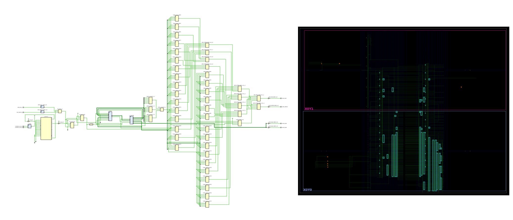

# Vivado Emulation — EK-SCU35-G

FPGA build flow for the RISC-V 32I core (`core_top`) targeting the AMD EK-SCU35-G evaluation board (`xcsu35p-sbvb625-2-e`, Spartan UltraScale+).

Uses Vivado **non-project mode** with checkpoint-based stages. The design is self-contained with on-chip BRAM, button-driven reset, and LED-based pass/fail reporting.

Shared build scripts and common RTL (e.g. `bram_memory.sv`) live in `../common/`. This board directory contains only board-specific files: `emu_top.sv`, XDC constraints, and a thin `Makefile` that sets board variables and includes the shared build rules.

> **Part string note:** If synthesis fails with an unrecognized part, verify the exact string by running `get_parts *xcsu35p*` in a Vivado Tcl session.

## Prerequisites

- Vivado (with **Spartan UltraScale+** device support)
- `vivado` on `$PATH`
- GNU Make

## Quick Start

```bash
cd emulation/vivado/ek_scu35_g

make all        # Full flow: lint → synth → opt → place → route → bitstream
make lint       # Just validate RTL syntax and hierarchy
make help       # Show all targets
```

## Build Targets

| Target | Description | Input | Output |
|---|---|---|---|
| `hex` | Convert test `.ini` to `$readmemh` format | `test/<name>/<name>.ini` | `build/<name>.hex` |
| `lint` | RTL elaboration — syntax, hierarchy, connectivity | RTL sources | `compile_order.rpt` |
| `synth` | Synthesis | RTL sources | `post_synth.dcp` |
| `opt` | Logic optimization (`opt_design`) | `post_synth.dcp` | `post_opt.dcp` |
| `place` | Placement (`place_design`) | `post_opt.dcp` | `post_place.dcp` |
| `route` | Routing (`route_design`) | `post_place.dcp` | `post_route.dcp` |
| `bitstream` | Bitstream generation | `post_route.dcp` | `emu_top.bit` |
| `clean` | Remove all build artifacts | — | — |

`make all` chains every stage in order. Each stage after `lint` requires the `build/latest` symlink (created by `lint`).

## Build Directory Layout

Each `make lint` (or `make all`) invocation creates a timestamped build directory with a `build/latest` symlink for easy access. Subsequent stages write into the same directory via the symlink.

```
build/
├── latest -> 20260209_143022
└── 20260209_143022/
    ├── lint/
    │   ├── lint.log
    │   └── compile_order.rpt
    ├── synth/
    │   ├── synth.log
    │   ├── post_synth.dcp
    │   ├── utilization.rpt
    │   ├── timing_summary.rpt
    │   └── methodology.rpt
    ├── opt/
    │   ├── opt.log
    │   ├── post_opt.dcp
    │   ├── utilization.rpt
    │   └── timing_summary.rpt
    ├── place/
    │   ├── place.log
    │   ├── post_place.dcp
    │   ├── utilization.rpt
    │   ├── timing_summary.rpt
    │   └── clock_utilization.rpt
    ├── route/
    │   ├── route.log
    │   ├── post_route.dcp
    │   ├── utilization.rpt
    │   ├── timing_summary.rpt
    │   ├── route_status.rpt
    │   └── power.rpt
    └── bitstream/
        ├── bitstream.log
        └── emu_top.bit
```

## Opening Checkpoints in the GUI

Any `.dcp` file can be opened directly in Vivado for interactive inspection:

```bash
vivado build/latest/synth/post_synth.dcp
vivado build/latest/route/post_route.dcp
```

## Architecture



### Sub-blocks

- **Clock path** — `SYSTEM_R_CLK_P/N` (200 MHz differential, Bank 46, 1.8 V LVDS) feeds an `IBUFDS` → `MMCME4_BASE` → `BUFG` chain to produce a 12 MHz core clock. MMCM configuration: VCO = 200 MHz × 6 / 1 = 1200 MHz; CLKOUT0 = 1200 / 100 = 12 MHz. The feedback path runs through a dedicated `BUFG`.
- **Reset** — Three sources, any of which asserts reset:
  1. `CPU_RESET_B = 0` — dedicated reset button (active-low, Bank 66, 3.3 V)
  2. `GPIO_SW_C = 1` — center pushbutton (active-high, Bank 45)
  3. `mmcm_locked = 0` — core held in reset until MMCM clock is stable

  Architecture: async-assert / sync-deassert (2-FF synchronizer, positive-edge).
- **core_top (DUT)** — The RISC-V 32I core under test, connected to memory via a simple read/write interface.
- **bram_memory** — 128 KB (32768 × 32-bit words) BRAM initialized with `$readmemh`. Provides 1-cycle read latency and byte-enable writes. The hex file is generated from a test `.ini` file by `../common/scripts/ini2hex.py` (the `make hex` target). The module source lives at `../common/rtl/bram_memory.sv`.
- **Magic address detector** — A write to any address matching `0xDEAD_xxxx` captures the test result: `wdata == 1` sets `pass_flag`, anything else sets `fail_flag`.
- **LED mapping** (Bank 45, individual named outputs):
  - `LED0_GREEN` — pass
  - `LED1_RED` — fail
  - `LED2_BLUE` — PC[12] activity
  - `LED3_BLUE` — PC[13] activity

### RTL Compilation Order

Source files are read in dependency order by the Tcl scripts in `../common/scripts/`. `datatypes.sv` is not read directly — it is pulled in via `` `include `` directives, with the include path set to `rtl/`.

### Constraints

The design XDC (`xdc/ek_scu35_g.xdc`) constrains only the pins actually used by `emu_top`. The build system uses a glob (`$xdc_dir/*.xdc`) to pick up all XDC files in the board's `xdc/` directory.

Key pin assignments:

| Signal | Pin | Bank | I/O Standard |
|---|---|---|---|
| `SYSTEM_R_CLK_P` | F23 | 46 | LVDS (1.8 V) |
| `SYSTEM_R_CLK_N` | E23 | 46 | LVDS (1.8 V) |
| `CPU_RESET_B` | F3 | 66 | LVCMOS33 |
| `GPIO_SW_C` | Y22 | 45 | LVCMOS33 |
| `LED0_GREEN` | AB18 | 45 | LVCMOS33 |
| `LED1_RED` | V18 | 45 | LVCMOS33 |
| `LED2_BLUE` | AA21 | 45 | LVCMOS33 |
| `LED3_BLUE` | U21 | 45 | LVCMOS33 |

The vendor master file (`xdc/reference/EK_SCU35_Rev3B.xdc`) is included for pin reference only and is **not** loaded during the build.

> **Bank 45 voltage note:** LEDs and `GPIO_SW_C` are in Bank 45, which is powered by the adjustable regulator `VR_VCCO_45_46_ADJ`. The eval-kit default is 3.3 V, matching the `LVCMOS33` standard above. If LEDs do not illuminate, verify the regulator setting against the board schematic.
